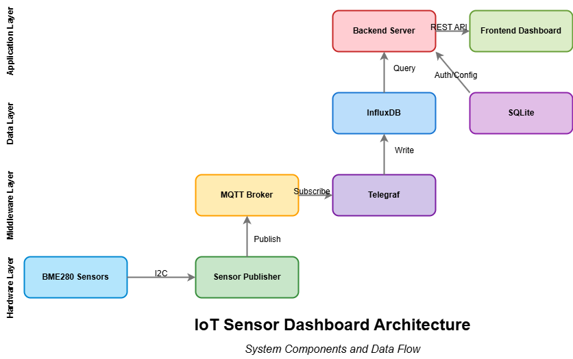
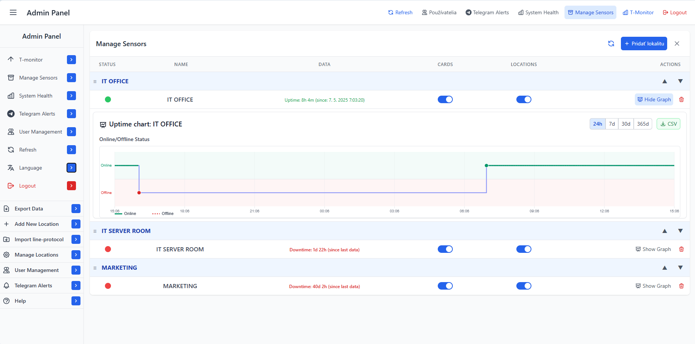

# IoT Sensor Dashboard

A comprehensive IoT monitoring solution featuring BME280 temperature/humidity/pressure sensors, MQTT messaging, InfluxDB time-series database, and a React dashboard with advanced visualization and logging capabilities.


## Enhanced Features

- **Real-time Monitoring:** Live data updates via MQTT with WebSocket support
- **Historical Data Analytics:** Time-series data stored in InfluxDB with efficient downsampling and querying
- **Advanced Visualization:** Interactive charts with zoom, scroll, fullscreen and state persistence
- **Smart Threshold Alerts:** Configurable visual indicators for temperature, humidity, and pressure readings
- **Multi-sensor Support:** Monitor unlimited locations simultaneously with automatic color coding
- **Comprehensive Logging System:** Performance metrics, error tracking, and event aggregation
- **Advanced Data Export:** Download data as Excel, CSV, or JSON with formatting options
- **Performance Optimization:** Smart rendering, data aggregation, and memory usage monitoring
- **Responsive Design:** Adaptive interface for desktop, tablet, and mobile devices
- **Dark/Light Mode:** Eye-friendly interface for 24/7 monitoring environments
- **Log Rotation:** Automated log management to prevent storage issues
- **User Authentication:** Secure access with role-based permissions

## System Architecture



The system consists of the following integrated components:

1. **BME280 Sensors** - Physical sensors connected to Raspberry Pi via I2C
2. **Sensor Publisher** - Python script with error handling to read sensors and publish to MQTT
3. **MQTT Broker** - Message broker for real-time data distribution with WebSocket support
4. **Telegraf** - Data collector that processes data from MQTT to InfluxDB with filtering
5. **InfluxDB** - Time-series database for efficient historical data storage and retrieval
6. **Backend Server** - Node.js Express server with API endpoints and authentication
7. **Frontend Dashboard** - React application with ApexCharts for visualization and performance monitoring

> **Note**: For a more detailed interactive view of the architecture, open `docs/architecture.html` in your web browser. Text-based representation is also available in `docs/architecture.txt`.

## Documentation

- [Installation Guide](docs/INSTALLATION.md) - Comprehensive setup instructions for all components
- [Performance Optimization](docs/PERFORMANCE_OPTIMIZATION.md) - Detailed overview of implemented performance optimizations
- [User Roles & Permissions](docs/USER_ROLES.md) - Complete guide to the role-based access control system

## Screenshots

### Main Dashboard


### Admin Panel


## Installation

For a quick installation, follow these steps:

1. Clone this repository
2. Install dependencies for each component
3. Configure environment variables
4. Start the services in the correct order

For a comprehensive, step-by-step installation guide with detailed instructions for each component, see the [INSTALLATION.md](docs/INSTALLATION.md) file.

## Quick Installation Guide

### Prerequisites

- Node.js 16+ and npm
- Python 3.7+
- Raspberry Pi or compatible device for sensor hardware
- Docker (recommended) or ability to install services locally
- Git

### 1. Clone the Repository

```bash
git clone https://github.com/majo1520/Pi-Temp-Dashboard.git
cd iot-sensor-dashboard
```

### 2. Install Dependencies

#### Frontend

```bash
cd frontend
npm install
npm run build
```

#### Backend

```bash
cd backend
npm install
```

### 3. Set Up InfluxDB

#### Using Docker (recommended)

```bash
mkdir -p data/influxdb data/influxdb-config

docker run -d -p 8086:8086 \
  --name influxdb \
  -v $PWD/data/influxdb:/var/lib/influxdb2 \
  -v $PWD/data/influxdb-config:/etc/influxdb2 \
  -e DOCKER_INFLUXDB_INIT_MODE=setup \
  -e DOCKER_INFLUXDB_INIT_USERNAME=admin \
  -e DOCKER_INFLUXDB_INIT_PASSWORD=password123 \
  -e DOCKER_INFLUXDB_INIT_ORG=iot_org \
  -e DOCKER_INFLUXDB_INIT_BUCKET=iot_sensors \
  -e DOCKER_INFLUXDB_INIT_ADMIN_TOKEN=my-super-secret-token \
  influxdb:2.6
```

### 4. Set Up MQTT Broker (Mosquitto)

#### Using Docker

```bash
mkdir -p data/mosquitto/config data/mosquitto/data data/mosquitto/log

# Create mosquitto configuration file
cat > data/mosquitto/config/mosquitto.conf << EOF
listener 1883
allow_anonymous true

# WebSockets support
listener 9001
protocol websockets

persistence true
persistence_location /mosquitto/data/
log_dest file /mosquitto/log/mosquitto.log
EOF

# Run the container
docker run -d -p 1883:1883 -p 9001:9001 \
  --name mosquitto \
  -v $PWD/data/mosquitto/config:/mosquitto/config \
  -v $PWD/data/mosquitto/data:/mosquitto/data \
  -v $PWD/data/mosquitto/log:/mosquitto/log \
  eclipse-mosquitto
```

### 5. Set Up Telegraf

Create a configuration file `telegraf.conf`:

```bash
mkdir -p data/telegraf

# Create telegraf configuration file
cat > data/telegraf/telegraf.conf << EOF
# Global agent configuration
[agent]
  interval = "10s"
  round_interval = true
  metric_batch_size = 1000
  metric_buffer_limit = 10000
  collection_jitter = "0s"
  flush_jitter = "0s"
  precision = ""
  debug = false
  quiet = false
  hostname = ""
  omit_hostname = false

# Output plugin for InfluxDB v2
[[outputs.influxdb_v2]]
  urls = ["http://influxdb:8086"]
  token = "my-super-secret-token"
  organization = "iot_org"
  bucket = "iot_sensors"

# MQTT Consumer Input Plugin
[[inputs.mqtt_consumer]]
  servers = ["tcp://mosquitto:1883"]
  topics = ["senzory/#"]
  data_format = "json"
  
  # Extract timestamp from JSON
  json_time_key = "timestamp"
  json_time_format = "2006-01-02 15:04:05"
  
  # Extract fields
  json_string_fields = ["location"]
  
  # Use location as a tag
  json_name_key = "location"
  tag_keys = ["location"]
  
  # Set measurement name to "bme280"
  measurement = "bme280"
EOF

# Create Docker network if it doesn't exist
docker network create iot-network || true

# Connect existing containers to the network
docker network connect iot-network influxdb || true
docker network connect iot-network mosquitto || true

# Run Telegraf container
docker run -d --name telegraf \
  --network iot-network \
  -v $PWD/data/telegraf:/etc/telegraf \
  telegraf
```

### 6. Set Up BME280 Sensor Publisher

#### Hardware Setup

1. Connect your BME280 sensor to the Raspberry Pi:
   - VCC to 3.3V
   - GND to GND
   - SCL to GPIO 3 (SCL)
   - SDA to GPIO 2 (SDA)

2. Enable I2C on Raspberry Pi:
   ```bash
   sudo raspi-config
   # Navigate to Interface Options > I2C > Enable
   ```

#### Install Python Dependencies

```bash
pip3 install adafruit-circuitpython-bme280 paho-mqtt zoneinfo configparser
```

#### Configure the Publisher

1. Create a configuration file in the `bme280_publisher` directory:

```bash
mkdir -p bme280_publisher

cat > bme280_publisher/sensor_config.ini << EOF
[mqtt]
host = localhost
port = 1883
username = 
password = 
use_tls = false
client_id = bme280-sensor1

[mqtt_topics]
legacy_topic = senzory/bme280
readings_topic = senzory/{location}/readings
status_topic = senzory/{location}/status
use_legacy_topic = true

[sensor]
location = IT OFFICE
sample_rate = 5
address = 0x76
sea_level_pressure = 1013.25
max_consecutive_errors = 5
init_retry_interval = 30

[data]
temp_min = -40
temp_max = 85
humidity_min = 0
humidity_max = 100
pressure_min = 300
pressure_max = 1100
EOF
```

2. Set up the publisher as a service:
   
```bash
sudo tee /etc/systemd/system/bme280-publisher.service > /dev/null << EOF
[Unit]
Description=BME280 Sensor Publisher
After=network.target

[Service]
ExecStart=/usr/bin/python3 $(pwd)/bme280_publisher/bme280_publisher.py
WorkingDirectory=$(pwd)/bme280_publisher
StandardOutput=inherit
StandardError=inherit
Restart=always
User=$(whoami)

[Install]
WantedBy=multi-user.target
EOF

# Enable and start the service
sudo systemctl daemon-reload
sudo systemctl enable bme280-publisher
sudo systemctl start bme280-publisher
```

### 7. Configure Backend Environment

Create a `.env` file in the backend directory:

```bash
cat > backend/.env << EOF
PORT=5000
INFLUX_URL=http://localhost:8086
INFLUX_TOKEN=my-super-secret-token
ORG=iot_org
BUCKET=iot_sensors
SESSION_SECRET=$(openssl rand -hex 32)
ENABLE_RATE_LIMITING=true
CORS_ALLOWED_ORIGINS=http://localhost:3000,http://localhost:5173,http://$(hostname -I | awk '{print $1}'):5000
ENABLE_ADVANCED_LOGGING=true
LOG_RETENTION_DAYS=30
EOF
```

### 8. Start the Application

#### Development Mode

For frontend (uses Vite dev server):
```bash
cd frontend
npm run dev
```

For backend:
```bash
cd backend
npm run dev
```

#### Production Mode

Set up as a service for reliable operation:

```bash
sudo tee /etc/systemd/system/iot-dashboard.service > /dev/null << EOF
[Unit]
Description=IoT Sensor Dashboard
After=network.target

[Service]
ExecStart=$(which npm) start
WorkingDirectory=$(pwd)/backend
StandardOutput=journal
StandardError=journal
Restart=always
User=$(whoami)
Environment=NODE_ENV=production

[Install]
WantedBy=multi-user.target
EOF

# Enable and start the service
sudo systemctl daemon-reload
sudo systemctl enable iot-dashboard
sudo systemctl start iot-dashboard
```

Access the dashboard at http://localhost:5000

## Advanced Configuration

### Enhanced Logging System

The dashboard includes an advanced logging system with the following features:

1. **Performance Metrics Tracking**
   - Chart rendering performance
   - Data load times
   - Memory usage monitoring
   - API response times

2. **Log Rotation and Aggregation**
   - Automatic log file rotation to prevent excessive disk usage
   - Log aggregation for statistical analysis
   - Configurable retention periods

3. **User Interaction Metrics**
   - Track chart zoom/pan operations
   - Monitor export operations
   - Record most viewed chart types

To enable detailed logging, set `ENABLE_ADVANCED_LOGGING=true` in your backend `.env` file.

### Threshold Configuration

Access the dashboard settings to configure thresholds for temperature, humidity, and pressure readings. These thresholds control:

- Visual indicators on charts
- Color coding for heatmaps
- Alert conditions
- Data highlighting

## Troubleshooting

### BME280 Publisher

- **Publisher won't start**: Check I2C connection with `i2cdetect -y 1`. Verify address matches in config.
- **No data in MQTT**: Run `mosquitto_sub -t "senzory/#" -v` to monitor MQTT messages.
- **Invalid readings**: Check sensor placement (avoid heat sources, direct sunlight).

### Backend

- **Cannot connect to InfluxDB**: Verify credentials and token in `.env` file.
- **API errors**: Check logs with `journalctl -u iot-dashboard`.
- **Performance issues**: Monitor `data/logs/performance.log` for bottlenecks.

### Frontend

- **Charts not showing data**: Open browser developer tools and check console for errors.
- **Slow performance**: Review chart performance logs in the Dashboard settings page.
- **Memory usage high**: Consider adjusting data aggregation settings in the dashboard configuration.

## System Maintenance

### Backup Database

Regular backups of InfluxDB and other data can be automated with the included script:

```bash
# Run the backup script
./scripts/backup_databases.sh
```

### Update System

Keep all components up to date:

```bash
# Update system components
./scripts/update_system.sh
```

## Component Versions

- Frontend: React 18.2.0, Vite 4.4.5, ApexCharts 3.41.0
- Backend: Node.js 16+, Express 4.18.2
- Database: InfluxDB 2.6
- MQTT: Mosquitto 2.0
- Telegraf: 1.25
- Python: 3.7+ with Adafruit CircuitPython BME280
- Logging: Advanced custom logging system with rotation

## License

This project is licensed under the MIT License - see the LICENSE file for details.

## Acknowledgments

- [ApexCharts](https://apexcharts.com/) for the chart library
- [Adafruit](https://www.adafruit.com/) for BME280 libraries
- [InfluxData](https://www.influxdata.com/) for time-series storage
- [Eclipse Mosquitto](https://mosquitto.org/) for MQTT broker

---
